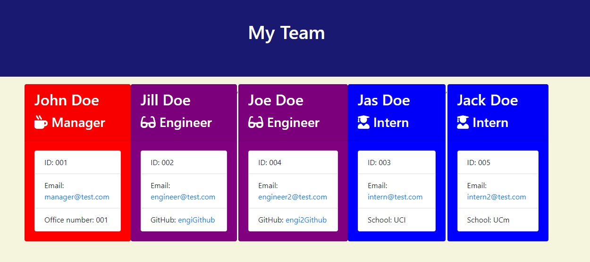
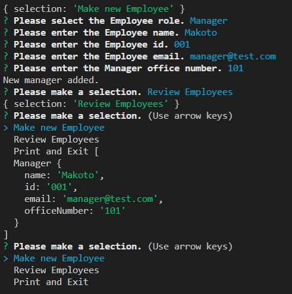
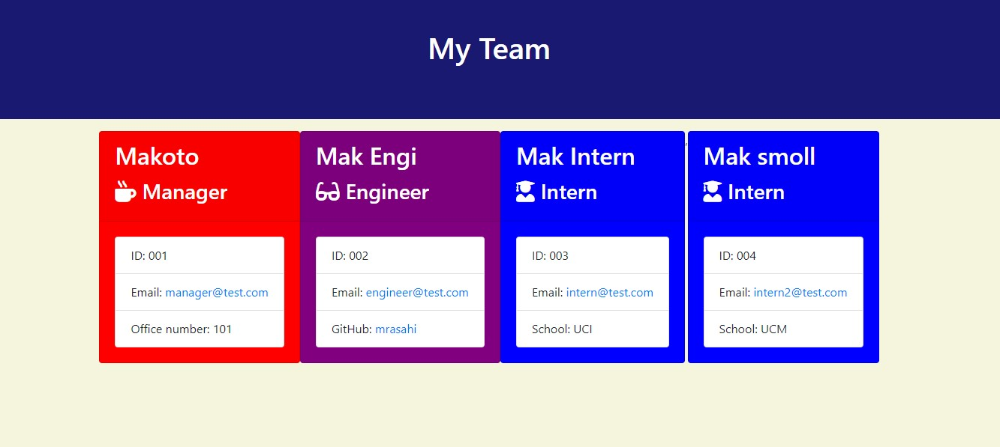

# templateEngine

Homework10 - Makoto Asahi

# Description

This app will make prompts to the user using the console.

The user can answer and fill out the prompts with information about the team.

Once the user is finished, the team information will be written as `team.html` in the output folder.

The html page list the team categorized into Manager, Engineer, and Intern.

The user can type `ctrl + c` anytime during the prompts to abort the app.

# Install

inquirer and jest are required to run this app.

run `npm install` in the terminal and it will download the required apps from package.json

Once the download is complete, run `node app.js` into the terminal.

# Tests

